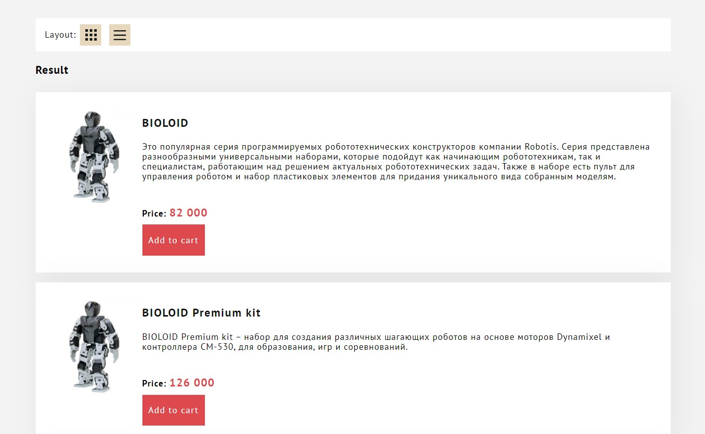

# :large_blue_circle: Switching table to grid layout

A study project at Practicum by Yandex with switching from table(grid) cards preview to a list layout.

---

## :mag_right: Preview

---

## :link: Links to test

https://dianadomino24.github.io/table-list-layout-robots

## :rocket: Technologies

-   **JavaScript ES6** - Promises, setTimeOut.

-   semantic **HTML5**, styles - **CSS3** including Flexbox, Grid-layout.

-   Objected Oriented Programming - classes.

---

**Practicum by Yandex** - https://practicum.yandex.com/

---

## :sparkles: Thanks for watching! :sparkles:
